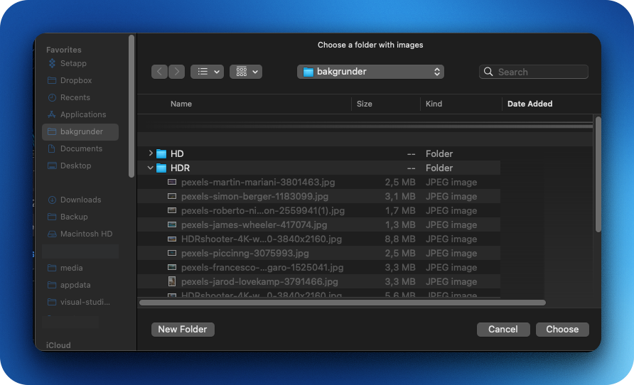
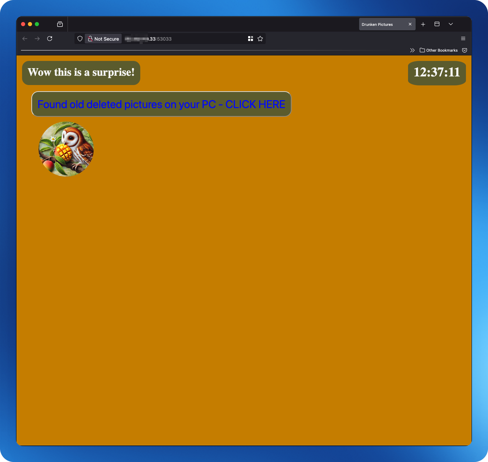
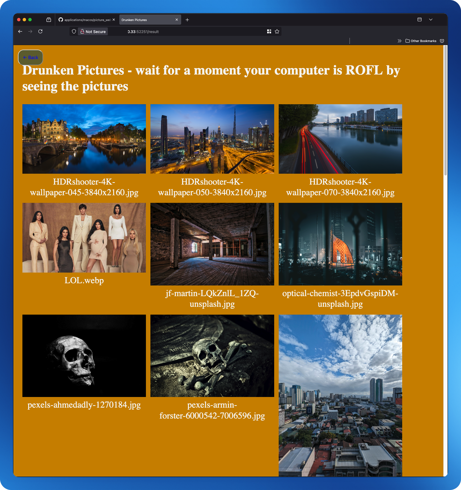

# Mac picture viewing application #

**Download a prebuilt app here:**

https://github.com/blitzes27/applications/releases/download/v0.1.0/ImageViewer.zip

You can build or download a prebuilt app. The Application is called ImageViewer and is built on pyflask.

## What does it do?

It opens a specified folder and shows all the picters in that folder on your host ip with a random port. It will open your standard browser and go to the webbsite. Anyone on the network with a phone or computer can go to that link and see the pictures





**When started it:**
* Opens finder and asks you to select a folder
* When a folder is selected it will open standard browser and display all the pictures in the folder.
* When a picture is clicked on it will open a new tab with the picture making it possible to get the full resulotion.
* ### The app currently need to be forced quit


# For those who want to build it

There are some tools you need in order to build the app.
If you need prerequisite then you are probably not the right person to travel this road.

## Prerequisites
```bash
# prerequisite installation.
xcode-select --install
# install Homebrew
/bin/bash -c "$(curl -fsSL https://raw.githubusercontent.com/Homebrew/install/HEAD/install.sh)"
# add Homebrew to PATH (SILICON  NOT INTEL)
echo 'eval "$(/opt/homebrew/bin/brew shellenv)"' >> ~/.zprofile
eval "$(/opt/homebrew/bin/brew shellenv)"
# Update brew
brew update
# Install git
brew install git
# Install Python 3 (includes pip3, ensurepip, setuptools, wheel)
brew install python
# Upgrade pip, setuptools, wheel
python3 -m pip install --upgrade pip setuptools wheel
```

## Command to build the app.

```bash
# Download folder & build the app
git clone --depth=1 --filter=blob:none --no-checkout git@github.com:blitzes27/applications.git
cd applications
git sparse-checkout init --cone
# Will only download macos/picture_website
git sparse-checkout set macos/picture_website
git checkout
cd macos/picture_website
# Create the virtual envoirment
python3 -m venv venv
# Activate the virtual envoirment
source venv/bin/activate
# Upgrade and install requirements
python3 -m pip install --upgrade pip
python3 -m pip install -r requirements.txt
# build the app
python3 setup.py py2app
# copy it to the desktop
cp -R dist/ImageViewer.app "$HOME/Desktop/ImageViewer.app"
```
The app can be found on Desktop or in 
* macos/picture_website/dist/ImageViewer.app

* The app currently needs to be Force quit

